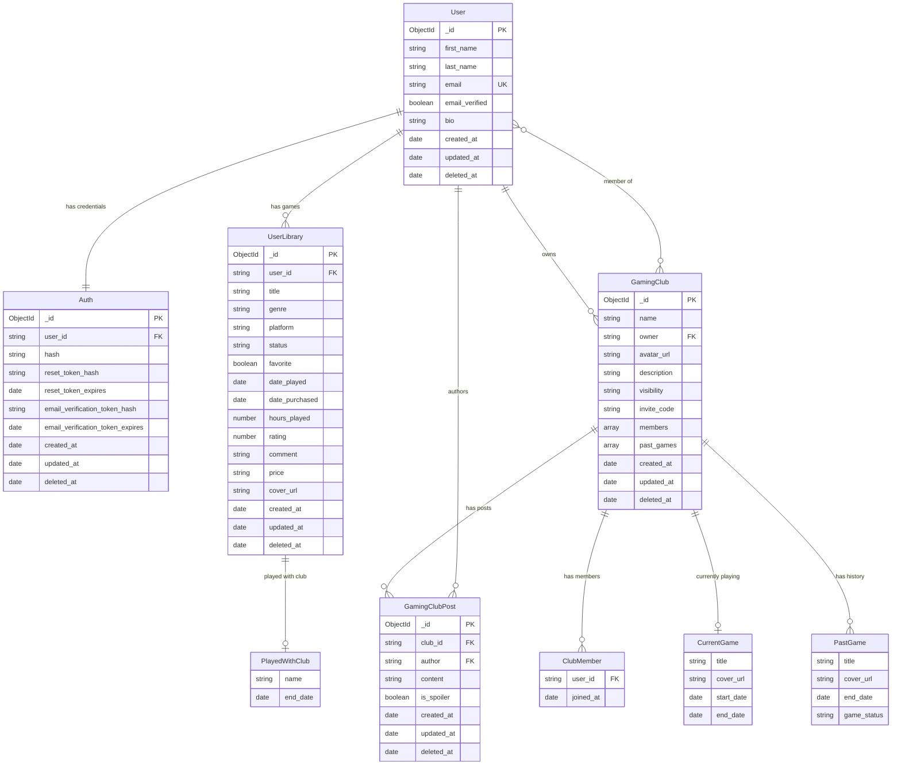

# Entity Relationship Diagram

> **Note:** A few of these entities (`PlayedWithClub`, `ClubMember`, `CurrentGame`, `PastGame`) aren't their own collections in MongoDB — they live embedded inside their parent documents. They're shown separately here just to keep the diagram readable.
