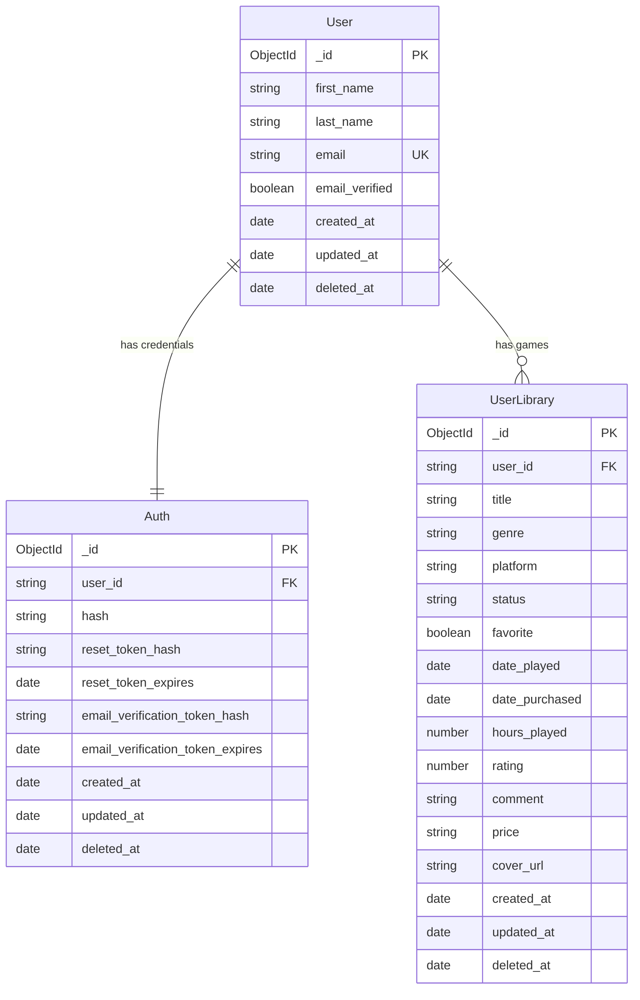

# Entity Relationship Diagram

```mermaid
erDiagram
    User {
        ObjectId _id PK
        string first_name
        string last_name
        string email UK
        boolean email_verified
        date created_at
        date updated_at
        date deleted_at
    }

    Auth {
        ObjectId _id PK
        string user_id FK
        string hash
        string reset_token_hash
        date reset_token_expires
        string email_verification_token_hash
        date email_verification_token_expires
        date created_at
        date updated_at
        date deleted_at
    }

    UserLibrary {
        ObjectId _id PK
        string user_id FK
        string title
        string genre
        string platform
        string status
        boolean favorite
        date date_played
        date date_purchased
        number hours_played
        number rating
        string comment
        string price
        string cover_url
        date created_at
        date updated_at
        date deleted_at
    }

    User ||--|| Auth : "has credentials"
    User ||--o{ UserLibrary : "has games"
```
